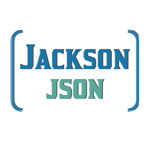

# RestApiTesting.Framework.Leopard 
This is a RESTful API testing Framework using Java, Maven, JUnit, REST Assured and Jackson to test JSONPlaceholder REST API.

## Project Natures

### Maven 
Apache Maven is a software project management and comprehension tool. Based on the concept of a project object model (POM), Maven can manage a project's build, reporting and documentation from a central piece of information.
https://maven.apache.org/

### JUnit 
JUnit is a simple framework to write repeatable tests. It is an instance of the xUnit architecture for unit testing frameworks.
https://junit.org/junit4/

## JSONPlaceholder  
JSONPlaceholder is a free online REST API that you can use whenever you need some fake data. It's great for tutorials, testing new libraries, sharing code examples.
https://jsonplaceholder.typicode.com/

## Routes Tested
The following HTTP methods are tested:
* GET
* POST
* PUT
* PATCH
* DELETE

## REST Assured  
Testing and validating REST services in Java is harder than in dynamic languages such as Ruby and Groovy. REST Assured brings the simplicity of using these languages into the Java domain.
http://rest-assured.io/

## Jackson  
Jackson is a high-performance JSON processor for Java. Its developers extol the combination of fast, correct, lightweight, and ergonomic attributes of the library.
https://github.com/FasterXML/jackson

## Integrated Development Environment
Eclipse IDE is used to develop this Framework.
